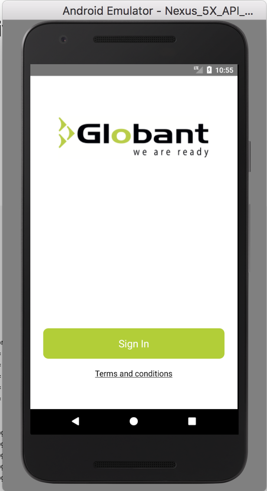
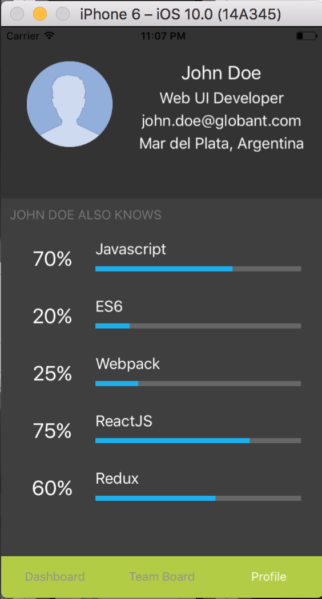

# Globant React Native Seed [WIP]

TBD

 <!---
[Ionic](https://ionicframework.com/) is the open-source mobile app development framework that makes it easy to
build top quality native and progressive web apps with web technologies.

Ionic is based on [Angular](https://angular.io/) and comes with many significant performance, usability, and
feature improvements over the past versions.

This is the official Ionic demo starter for React Native Globant Projects, showcasing a variety of Ionic Framework components and native features.-->

## Table of Contents

  <!--- - [Getting Started](#getting-started)
 - [Executing](#executing)
 - [Enviroment Information](#enviroment-information)
 - [Unit Testing](#unit-testing)
 - [e2e Testing](#e2e-testing) 
 - [Use Cases](#use-cases) --->

* [App Preview](#app-preview)
* [File Structure of App](#file-structure-of-app)
  <!--- - - [Contributors](#contributors)

## Getting Started

* [Download the installer](https://nodejs.org/) for Node.js 6 or greater.
* Install the ionic CLI globally: `npm install -g ionic`
* Clone this repository: `git clone https://github.com/ionic-team/ionic-conference-app.git`.
* Run `npm install` from the project root.
* Run `ionic serve` in a terminal from the project root.

_Note: You may need to add “sudo” in front of any global commands to install the utilities._

## Executing

* Run `npm run clean` from the project root, to clean cache system and outdated assets.
* Run `npm run build` from the project root, to build the production ready deploy.
* Run `npm run lint` from the project root, to run the tslint review.
* Run `npm run ionic:serve-dev` from the project root to run the application in development enviroment
* Run `npm run ionic:serve-prod` from the project root to run the application in production enviroment enviroment

### Enviroment Information

Since Ionic use the power of the new angular-cli it has the concept of different environments like development (dev) and production (prod). The ./environments folder is a part of the scaffold which contains the environment files, the set of environments for this project are dev and prod but you can easily add more environments as you want simply using a new file i.e environment.feat.ts and the updating the package.json writing a new line in the scripts section:

```
 "private": true,
  "scripts": {
    "clean": "ionic-app-scripts clean",
    ...
    "ionic:serve-dev": "cross-env NODE_ENV=dev ionic-app-scripts serve",
    "ionic:serve-prod": "cross-env NODE_ENV=prod ionic-app-scripts serve  --prod",
    "ionic:serve-feat": "cross-env NODE_ENV=feat ionic-app-scripts serve",
    ...
  },
  "dependencies": {
    "@angular/common": "5.0.3",
    ...
```

## Unit Testing

This seed comes with a set of unit tests full documented inside the project, you can note every component services has associated a file ...spec.ts in which the unit tests are written down, we encourage to keep the coverage over 80 percent in every development phase. You can use the unit tests as an skeleton of the your new tests and features of your app, we try to keep them in the best possible way, below you can find the existing tests, have in mind all the configurations are located in the folder: ./test-config

* Run `npm run test` to run all unit tests and keep watching the changes.
* Run `npm run test-ci` to run all unit tests and finish after first run, perfect for CI systems.
* Run `npm run test-coverage` to run all unit tests, keep watching and write the coverage files in the folder ./coverage

_Note: You may note the angular/ionic ecosystem works better with the stack karma/jasmine for the unit testsing, however feel free to use any other testing language or test runner i.e mocha and hit us with a Pull Request._

## e2e Testing

e2e or end-to-end or UI testing is a methodology used to test whether the flow of an application is performing as designed from start to finish. In simple words, it is testing of your application from the user endpoint where the whole system is a black box with only the UI exposed to the user. Sice there are a variety of ways to afford the e2e testing we provide a sample testing using protractor/jasmine with only one view, it would help you to test the app integration and how the components work together, also we provide a command below to run the e2e tests:

* Run `npm run e2e` to run all end to end (e2e) tests.

## Use cases

* Action Sheet - [ [template](https://github.corp.globant.com/ui-engineering/seed-ionic/edit/master/src/pages/settings/settings.html) | [code](https://github.corp.globant.com/ui-engineering/seed-ionic/edit/master/src/pages/settings/settings.ts) ]
* Alert - [ [code](https://github.corp.globant.com/ui-engineering/seed-ionic/edit/master/src/pages/schedule/schedule.ts) ]
* Cards - [ [template](https://github.corp.globant.com/ui-engineering/seed-ionic/edit/master/src/pages/speaker-list/speaker-list.html) ]
* Inputs - [ [template](https://github.corp.globant.com/ui-engineering/seed-ionic/edit/master/src/pages/signup/signup.html) ]
* Items (Sliding) - [ [template](https://github.corp.globant.com/ui-engineering/seed-ionic/edit/master/src/pages/all-events/all-events.html) | [code](https://github.corp.globant.com/ui-engineering/seed-ionic/edit/master/src/pages/all-events/all-events.ts) ]
* Modal - [ [template](https://github.corp.globant.com/ui-engineering/seed-ionic/edit/master/src/pages/login/login.html) | [code](https://github.com/ionic-team/ionic-conference-app/blob/master/src/pages/login/login.ts) ]
* Tabs - [ [template](https://github.corp.globant.com/ui-engineering/seed-ionic/edit/master/src/pages/tabs/tabs.html) | [code](https://github.com/ionic-team/ionic-conference-app/blob/master/src/pages/tabs/tabs.ts) ]
* Toggle - [ [template](https://github.corp.globant.com/ui-engineering/seed-ionic/edit/master/src/pages/settings/settings.html) ]

--->

## App structure

```
seed-react-native/
|-- resources/
|
|-- android/
|
|-- ios/
|
|-- app/
|    |-- assets/
|    |
|    |-- components/                        * Contains all componentes with his style and UT
│    │    ├── touchableList/                * touchable list component
│    │    │    ├── index.js            * touchableList code
│    │    │    └── index.spec.js              * touchableList UT
│    │    │    └── style.js            * touchableList style
|    |    |
│    |-- navigator/                      * Contains all scenes or pages that the user can navigate
│    │    ├── index.js
|    |    |
│    │    │── login/                     * LoginPage page
│    │    │    ├── login.html            * LoginPage template
│    │    │    └── login.ts              * LoginPage code
│    │    │    └── login.scss            * LoginPage stylesheet
│    │    │    └── login.spec.ts         * LoginPage unit tests
│    │    │
│    │    │
│    │    │── all-events/                  * All Events Page tab page
│    │    │    ├── all-events.html         * All Events Page template
│    │    │    └── all-events.ts           * All Events Page code
│    │    │    └── all-events.scss         * All Events Page stylesheet
│    │    │    └── all-events.ts           * All Events Page code
│    │    │
│    │    │── conferences-list/             * Schedule ConferencesListPage page
│    │    │    ├── conferences-list.html    * ConferencesListPage template
│    │    │    └── conferences-list.ts      * ConferencesListPage code
│    │    │    └── conferences-list.scss    * ConferencesListPage stylesheet
│    │    │    └── conferences-list.spec.ts * ConferencesListPage Unit tests
│    │    │
│    │    │── session-detail/            * Session Detail page
│    │    │    ├── session-detail.html   * SessionDetailPage template
│    │    │    └── session-detail.ts     * SessionDetailPage code
│    │    │
│    │    │── signup/                    * Signup page
│    │    │    ├── signup.html           * SignupPage template
│    │    │    └── signup.ts             * SignupPage code
│    │    │    └── signup.spec.ts        * SignupPage unit Tests code
│    │    │
│    │    │── conference-detail/               * conference Detail page
│    │    │    ├── conference-detail.html      * conferenceDetailPage template
│    │    │    └── conference-detail.ts        * conferenceDetailPage code
│    │    │    └── conference-detail.scss      * conferenceDetailPage stylesheet
│    │    │    └── conference-detail.spec.ts   * conferenceDetailPage unit tests
│    │    │
│    │    │
│    │    │── tabs/                      * Tabs page
│    │    │    ├── tabs.html             * TabsPage template
│    │    │    └── tabs.ts               * TabsPage code
|    |
│    ├── providers/                      * Contains all Injectables
│    │     ├── conference-data.ts        * ConferenceData code
│    │     └── user-data.ts              * UserData code
|    |
│    ├── environments/
│    │     ├── environment.ts             * Production environtment vars
│    │     ├── environment.dev.ts         * Development environtment vars
|    |
│    ├── theme/                          * App theme files
|    |     ├── variables.scss            * App Shared Sass Variables
|    |
|    |-- index.html
|
|-- www/
|    ├── assets/
|    |    ├── data/
|    |    |    └── login.json
|    |    |    └── profile.json
|    |    |
|    |    ├── fonts/
|    |    |     ├── ionicons.eot
|    |    |     └── ionicons.svg
|    |    |     └── ionicons.ttf
|    |    |     └── ionicons.woff
|    |    |     └── ionicons.woff2
|    |    |
|    |    ├── img/
|    |
|    └── build/
|    └── index.html
|
├── .editorconfig                       * Defines coding styles between editors
├── .gitignore                          * Example git ignore file
├── LICENSE                             * Apache License
├── README.md                           * This file
├── config.xml                          * Cordova configuration file
├── ionic.config.json                   * Ionic configuration file
├── package.json                        * Defines our JavaScript dependencies
├── tsconfig.json                       * Defines the root files and the compiler options
├── tslint.json                         * Defines the rules for the TypeScript linter
```

## App preview

### Android

| Login                                                               |                               Dashboard                               |                                                             Team Board |
| ------------------------------------------------------------------- | :-------------------------------------------------------------------: | ---------------------------------------------------------------------: |
|    |  |  |
| **Details**                                                         |                              **Profile**                              |                                                                        |
|  |    |                                                                        |

## iOS

| Login                                                           |                             Dashboard                             |                                                         Team Board |
| --------------------------------------------------------------- | :---------------------------------------------------------------: | -----------------------------------------------------------------: |
|    |  |  |
| **Details**                                                     |                            **Profile**                            |                                                                    |
|  |    |                                                                    |

<!--- 
## Contributors

Thanks goes to these wonderful people:

<br /><sub><b>Sebastian Gomez</b></sub>  <br /> <sub>(Practice Lead Hybrid)</sub><br /> <br />
<br /><sub><b>Diego Castro</b></sub><br /><sub>(Web UI Dev - Medellín)</sub><br /> <br />
--->

MVP

* React-native
* Redux
* Saga
* Crashlytics
* Fabric
* Date-fns
* Eslint + prettier
* Unit Testing [Jest]
* I18n
* CI
* Releases [Fastlane + TestFairy]

Pending

* Realm
* E2E
* Accessibility
* Dynamic JS Bundle

Seed Functionality (Default)

* Login
* Create Account
* Main Page - List
* Navigation
* Call a service
* Unit testing example
